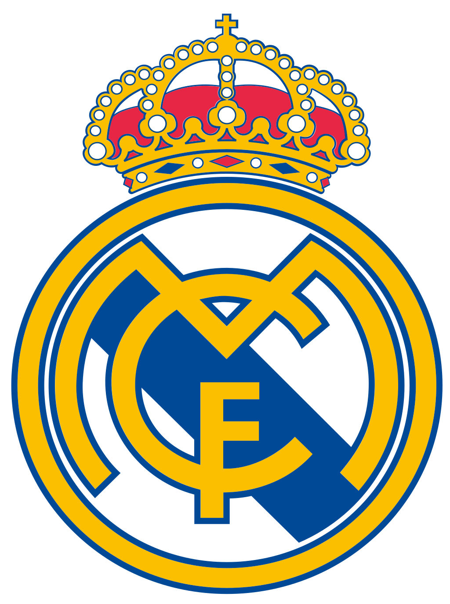

# **Moises Ruiz**
### *My User Page*


**Some git commands I used for _this_ lab are:**
```
git clone
git branch
git checkout
git add
git commit
git push
```
I really enjoy ~~playing and~~ watching soccer.
***I do enjoy playing but I have not played in a while***
**The teams I go for are:**
- [Cruz Azul](cruz_azul.jpg)
> La Novena
- [Real Madrid](Real_Madrid_CF.png)
> Hala Madrid



**My classes this quarter are:**
1. CSE 101
2. CSE 110
3. MATH 103A
4. MATH 180A

*My classes on Monday:*
- [x] MATH 130A Lecture
- [ ] MATH 180A Lecture
- [ ] CSE 110 Discussion
- [ ] MATH 103A Discussion

I like Pokemon and I use [Serebii](https://www.serebii.net) for it a lot.

I learned how to do section links on [Github Docs](https://docs.github.com/en/github/writing-on-github/getting-started-with-writing-and-formatting-on-github/basic-writing-and-formatting-syntax#section-links).
